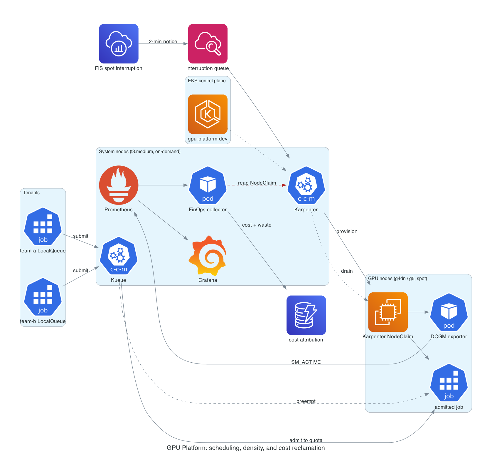

# GPU Platform

Multi-tenant GPU scheduling on EKS with per-second cost attribution and an
idle-GPU reclaimer. Karpenter provisions spot GPU nodes on demand, Kueue
admits work against tenant quota with preemption, and a FinOps collector
measures what the fleet actually did with the silicon it rented.



## Cost and teardown, up front

Roughly **$0.50/hour** all-in: EKS control plane $0.10, two t3.medium system
nodes about $0.08, two g4dn.xlarge on spot about $0.32. A six-hour
deploy-demo-destroy window lands near **$3**.

Teardown risk is concentrated in one place: **Karpenter's GPU nodes are not
owned by the EKS module.** They carry finalizers and Terraform never tracked
the instances, so destroying the cluster first leaves ENIs attached to
instances the VPC delete then blocks on. `make destroy` deletes NodeClaims
first for that reason. Do not run `terraform destroy` on its own.

Nothing here is long-running. The `expireAfter` on the NodePool caps any GPU
node at 8 hours even if a teardown is forgotten.

## Prerequisites

The G and VT vCPU service quotas are **zero by default** on a fresh account,
in every region, and Karpenter will provision nothing until they are raised:

```
L-DB2E81BA   Running On-Demand G and VT instances
L-3819A6DF   All G and VT Spot Instance Requests
```

Both are quoted in **vCPUs, not instances**. The GPU NodePool pins
`instance-gpu-count` to 1, so 8 vCPUs buys two g4dn.xlarge or g5.xlarge, which
is two physical cards. The defaults in `terraform/variables.tf` are set for
that: `gpu_cpu_limit = 8` and `gpu_quota = 2`.

The NodePool also pins `instance-cpu`, and it has to. Both g4dn.xlarge (4 vCPU)
and g4dn.2xlarge (8 vCPU) carry exactly one card, so without the pin Karpenter
may take the larger one on price and spend the whole 8 vCPU budget on a single
GPU while Kueue keeps admitting 2. The second job then pends forever behind
"all available instance types exceed limits for nodepool". The cost of pinning
is spot diversity, which is why four families are listed rather than two: with
only g4dn and g5 the pin leaves a single viable instance type, and provisioning
fails outright with `InsufficientInstanceCapacity` whenever that one pool is
dry.

Spot also needs the **`AWSServiceRoleForEC2Spot`** service-linked role, which a
fresh account does not have. Terraform creates it (`create_spot_service_linked_role`,
default true; set false where it already exists). Without it Karpenter does not
error, it silently launches on-demand instead, which voids both the spot
savings this project measures and the act 5 interruption demo.

8 is the working minimum. 32 is worth requesting for headroom, but the two
variables above must be raised to match whatever is actually *granted*, not
what was asked for. A limit above the real quota inverts its purpose: Karpenter
returns `VcpuLimitExceeded` instead of a clean unschedulable pod, and a Kueue
quota above the schedulable count admits work that then sits Pending forever.

They are separate requests, they are per-region, and they go to AWS support
rather than resolving instantly. File them before anything else.

## Deploy

```bash
make venv
make test        # 37 unit tests, terraform fmt + validate, policy gates
make deploy      # ECR first, then push the image, then everything else
```

`make deploy` applies in stages on purpose, and the staging is load-bearing:

1. **ECR alone**, because the collector Deployment references an image that
   must already exist and the image cannot be pushed until the repository does.
2. **`module.vpc` and `module.eks` together.** The kubernetes, helm and kubectl
   providers are all configured from `module.eks` outputs, and `alekc/kubectl`
   validates its config at plan time rather than deferring, so a single-shot
   apply dies with "no configuration has been provided" before creating
   anything. `module.vpc` must be targeted alongside it: `-target` pulls in
   only what the target depends on, and the cluster depends on the VPC and
   subnets but *not* on the NAT gateway or private route tables. Target the
   cluster alone and the nodes boot with no egress, never register, and the
   node group sits in CREATING until it times out with an empty
   `health.issues` list.
3. **Everything else**, once the cluster exists and the CRDs are installed.

## Demo

```bash
make demo              # all six acts
./scripts/demo.sh 4    # or one at a time
```

| Act | What it proves |
|---|---|
| 1 | Karpenter provisions a GPU node from zero, Ready in ~50s, workload running ~40s later |
| 2 | Kueue admits 2 of 12 jobs to quota (the granted G/VT quota) and queues the rest |
| 3 | A high-priority job preempts a low-priority one, which requeues rather than dying |
| 4 | Time-slicing advertises one physical T4 as 4 schedulable GPUs, with cost per job on each |
| 5 | A real spot interruption drains gracefully and the workload requeues |
| 6 | The reaper flags an idle GPU with a dollar figure, in dry-run, before it is trusted to delete |

## Three things worth explaining

### The utilization metric everyone graphs is the wrong one

`DCGM_FI_DEV_GPU_UTIL` reports the fraction of time at least one kernel was
resident on the device. It does not report how much of the device was working.
A single small kernel looping on one SM pins that gauge at 100% while the rest
of the card idles, which is why GPU fleets routinely look saturated and are
mostly wasted.

The reaper keys on `DCGM_FI_PROF_SM_ACTIVE` instead, the profiling counter for
the fraction of SMs with a warp resident. Both are recorded on every sample so
the gap between them is visible in the data rather than asserted here.

Measured on this cluster, one sample of a `g6e.xlarge` spot node running the
nbody load:

| GPU_UTIL | SM_ACTIVE | interval cost | of which wasted |
|---|---|---|---|
| 100% | 45.82% | $0.031017 | $0.016805 |

The driver gauge calls that card fully utilized. 54% of what it cost bought
nothing. That is the entire argument for keying on the profiling counter, and
it is the number this project exists to produce.

`DCGM_FI_PROF_SM_ACTIVE` is **not** in dcgm-exporter's default metric set,
which ships `GR_ENGINE_ACTIVE`, `DRAM_ACTIVE` and `PIPE_TENSOR_ACTIVE` but not
SM_ACTIVE. Terraform therefore supplies its own metrics ConfigMap. Without it
the collector queries a series that does not exist, logs "no GPU samples yet"
once a minute forever, and writes no cost records at all, with nothing
anywhere reporting an error.

### Cost Explorer cannot do this job

It reports at daily granularity and lags 8 to 24 hours, so a three-hour GPU
demo never appears in it while the demo is running. Accelerators are rented by
the second and go idle for minutes at a time, so the unit of waste is far
smaller than the smallest unit Cost Explorer can see.

Rates come from the Pricing API for on-demand and the spot price history for
spot; quantity comes from observed instance-seconds. The `wasted_cost_usd`
field is deliberately a linear function of SM occupancy. Fractional occupancy
does not map to fractional dollars in any rigorous way, since you rent the
whole card either way. It ranks nodes by waste. It is not an accounting figure.

### MIG is documented, not deployed

Multi-Instance GPU gives hardware-enforced isolation between slices, which
time-slicing cannot: time-slicing is cooperative context switching, so every
replica sees full memory and can OOM its neighbours.

MIG requires A100, H100, H200, B200, or A30 silicon. This project runs on T4
(g4dn), A10G (g5), L4 (g6) and L40S (g6e), and **none of them supports it**. That is not a driver flag or
a licensing tier, the partitioning hardware is absent. The cheapest MIG-capable
EC2 instance is p4d.24xlarge at roughly $32/hour behind its own quota gate,
about 100x this project's entire budget.

So act 4 measures dedicated versus time-sliced, both real and both on hardware
this project actually runs, and `k8s/gpu-operator/mig-profiles.yaml` carries
the full MIG configuration with the steps to enable it. Priced and declined,
rather than quietly skipped.

## Safety on the reaper

Automatically terminating expensive hardware fails badly when it fails, so the
reaper holds on four separate checks before it acts:

1. The node carries `workload-class=gpu`. System nodes are never candidates.
2. No admitted Kueue Workload is bound to it. A job between checkpoints reads
   as idle on SM occupancy and must not be killed for it.
3. No non-DaemonSet pods are running on it.
4. The idle streak spans the full window of consecutive samples, not one
   unlucky scrape.

If the Kueue API cannot be reached, the check fails safe and treats the node
as busy. And it ships in dry-run: `reaper_dry_run` defaults to `true`, writing
`would_terminate` records with the dollar figure attached. Arm it with
`terraform apply -var reaper_dry_run=false` once the dry-run records look
right.

It deletes the Karpenter **NodeClaim**, not the Node. Deleting a Node alone
accomplishes nothing, Karpenter reconciles a replacement within seconds.

## Layout

```
terraform/     VPC, EKS, Karpenter, GPU Operator, Kueue, Prometheus, FIS, DynamoDB
finops/        collector: Prometheus sampling, cost attribution, reaper
k8s/           NodePool, time-slicing config, MIG profiles, demo workloads
scripts/       the six demo acts
```

## Teardown

```bash
make destroy
```

Deletes NodeClaims first, then everything else, then prints any surviving
instance tagged `Project=gpu-platform` so a clean teardown is verified rather
than assumed.
